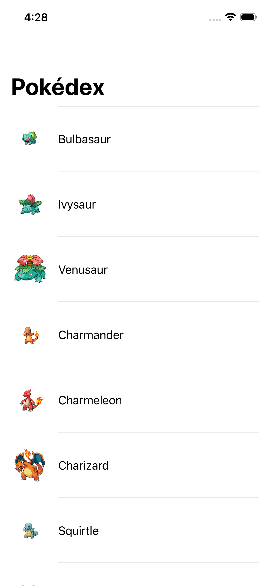

# PruebaTSoft — Pokédex (Assessment Técnico iOS)

[](https://github.com/IranCarrillo02/PruebaTSoft/actions/workflows/ci.yml)

App en SwiftUI que consume [PokéAPI](https://pokeapi.co/) para mostrar un listado de los primeros Pokémon (con paginación incremental) y una pantalla de detalle, construida con Clean Architecture + MVVM, persistencia local con SwiftData y cobertura de tests en las tres capas.



## Requisitos

- Xcode 26.2 o superior (Swift 5, SDK de iOS 26).
- Sin dependencias externas: no hay que correr `pod install`, resolver paquetes SPM de terceros ni configurar variables de entorno o API keys.

## Cómo ejecutar

1. Clona el repositorio.
2. Abre `PruebaTSoft/PruebaTSoft.xcodeproj` en Xcode.
3. Selecciona el scheme `PruebaTSoft` y cualquier simulador de iPhone.
4. `Cmd+R` para correr.

No hay pasos manuales adicionales ni configuración ambigua: el proyecto compila y corre tal cual se clona.

## Cómo correr las pruebas

Desde Xcode: `Cmd+U`.

Desde terminal:

```bash
xcodebuild test \
  -project PruebaTSoft/PruebaTSoft.xcodeproj \
  -scheme PruebaTSoft \
  -destination 'platform=iOS Simulator,name=<tu simulador>'
```

El pipeline de CI (`.github/workflows/ci.yml`) resuelve el simulador disponible dinámicamente en lugar de asumir un nombre fijo — corre en cada push/PR a `main` e incluye SwiftLint + build + test completo.

## Arquitectura

Clean Architecture (Domain / Data / Presentation) + MVVM, dentro de un solo target de Xcode con separación por carpetas:

```
PruebaTSoft/
  App/                    Composition root (DependencyContainer) + punto de entrada
  Domain/
    Entities/             Pokemon, PokemonDetail — structs planos, sin dependencias de frameworks
    Repositories/          PokemonRepositoryProtocol
    UseCases/              FetchPokemonListUseCase, FetchPokemonDetailUseCase
    Errors/                AppError (mapeo centralizado de errores)
  Data/
    Network/               APIClient (async/await), PokeAPIEndpoint, DTOs, ImageLoader
    Persistence/            Modelos SwiftData + PokemonLocalDataSource
    Mappers/                DTO <-> Domain <-> SwiftData
    Repositories/           PokemonRepository (orquesta red + caché)
  Presentation/
    PokemonList/            View + ViewModel del listado
    PokemonDetail/          View + ViewModel del detalle
    Common/                 Componentes compartidos (estados de carga/error/vacío, imagen con caché, badges, stat bars)
PruebaTSoftTests/           Tests unitarios + de integración (Swift Testing)
PruebaTSoftUITests/         Smoke tests end-to-end (XCTest/XCUITest)
```

**Regla de dependencia:** Presentation → Domain ← Data. `Domain/` no importa SwiftUI, SwiftData ni URLSession — es lógica de negocio pura, testeable en aislamiento e independiente de qué tecnología de red o persistencia se use debajo.

Las decisiones técnicas detrás de cada capa están documentadas con su razonamiento en [`docs/decisions.md`](docs/decisions.md) — vale la pena leerlo para entender el *por qué*, no solo el *qué*.

## Persistencia

Estrategia **network-first con fallback a caché** usando SwiftData: cada pantalla intenta primero la llamada de red; si tiene éxito, actualiza la caché local y muestra esos datos; si falla (sin conexión, timeout, error de servidor), recurre al último snapshot cacheado si existe, y solo si tampoco hay caché muestra el estado de error. Esto da experiencia offline parcial y consistencia razonable sin construir un motor de sincronización completo. Detalle y justificación en `docs/decisions.md` (ADR-004).

## Por qué cero librerías de terceros

Todo lo necesario (networking, persistencia, imágenes, testing) está cubierto por Foundation/SwiftUI/SwiftData/XCTest/Swift Testing. Esto evita cualquier paso de resolución de paquetes que pudiera fallar o quedar desactualizado en la máquina de quien revise el reto, y mantiene el alcance del proyecto honesto para lo que pide el assessment. El trade-off (por ejemplo, frente a usar Kingfisher para imágenes o Alamofire para red) está documentado en `docs/decisions.md` (ADR-005).

## Cobertura de los adicionales (bonus) del reto

| Punto del PDF | Cómo se cubrió |
|---|---|
| Paginación / carga incremental | Scroll infinito: `PokemonListViewModel` pide la siguiente página (`offset`/`limit`) cuando el usuario se acerca al final de la lista. |
| Mejoras de UX/UI, animaciones, skeleton loaders | Filas skeleton animadas durante la carga inicial y de paginación, pull-to-refresh, transiciones sutiles entre estados. |
| Testing unitario / integración / componentes | Unit tests de Domain, Data y Presentation + un test de integración de `PokemonRepository` contra `URLProtocol` real y SwiftData real en memoria + smoke tests XCUITest end-to-end contra la API real. |
| Manejo centralizado de errores | `AppError` (Domain) — un único punto donde los errores se traducen a mensajes para el usuario; ambas pantallas lo consumen igual. |
| Accesibilidad | Etiquetas y traits de VoiceOver en imágenes y filas, tipografía con Dynamic Type (sin tamaños fijos), elementos combinados para lectura coherente. |
| Optimizaciones de rendimiento | `ImageLoader` con `NSCache` (evita re-descargar sprites), `@Observable` para invalidaciones de vista más finas que `ObservableObject`, virtualización nativa de `List`. |
| Documentación de decisiones técnicas | Este README + [`docs/decisions.md`](docs/decisions.md) con una entrada por decisión relevante. |
| Linting / CI | `.swiftlint.yml` + GitHub Actions corriendo lint + build + test en cada push/PR. |

## Testing

- **Unit tests** (Domain/Data/Presentation): casos de uso contra un repositorio mockeado, mappers, `PokemonRepository` contra un `APIClient`/`PokemonLocalDataSource` mockeados, y ambos ViewModels contra sus casos de uso mockeados.
- **Test de integración**: `PokemonRepository` de extremo a extremo contra un `URLSession` con `URLProtocol` real (JSON real, decodificación real) y un `ModelContainer` de SwiftData real en memoria — valida la estrategia network-first/cache-fallback sin mocks de por medio.
- **UI tests (XCUITest)**: `PokemonFlowUITests` lanza la app real y navega contra la PokéAPI real (sin stubs), verificando que el listado cargue y que la navegación a detalle funcione de punta a punta.

## Pendientes / mejoras futuras

- Auditoría completa de accesibilidad con VoiceOver (rotor, orden de navegación) — se cubrieron etiquetas y traits básicos, pero no un pase exhaustivo.
- Más cobertura de XCUITest (estado de error, pull-to-refresh, paginación) — se priorizó un smoke test de la ruta principal dado el tiempo del reto.
- Indicador visual explícito de "mostrando datos en caché" cuando la red falla y se usa el fallback — hoy el fallback es transparente para el usuario.
